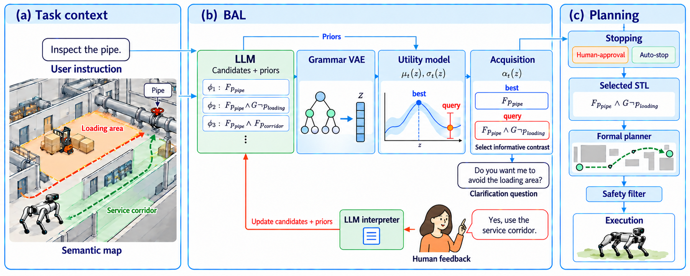

# Bayesian Active Learning for Intent Disambiguation in Interactive Robot Planning

**Huao Li<sup>1</sup>, Carson Sobolewski<sup>1</sup>, Augustinos Saravanos<sup>1</sup>, William Tan<sup>2</sup>, John Karigiannis<sup>2</sup>, Chuchu Fan<sup>1</sup>**
<sup>1</sup>Massachusetts Institute of Technology &nbsp; <sup>2</sup>GE Vernova

*CoRL 2026* · *Human-Robot Dialogue Workshop, IROS 2026*

[Project page](https://www.huao-li.com/bal.github.io/) · [Paper](#) · [arXiv](#) · [Code](#) · [Video](#)



## Overview

Natural-language instructions to robots are often ambiguous, incomplete, or underspecified. Large language models (LLMs) are a natural interface for asking clarification questions, but relying on the LLM alone to drive a multi-turn conversation can cause systematic failures: context loss, overconfidence, and sycophancy.

**BAL** treats clarification as a **Bayesian active learning problem over grounded Signal Temporal Logic (STL) task specifications**:

- An **LLM** proposes candidate STL specifications with prior utility estimates, and turns informative contrasts into natural-language clarification questions.
- A **grammar VAE** embeds STL formulas into a continuous latent space in which every point decodes to a valid formula.
- A **Gaussian process** over that space tracks uncertainty about the user's intent, and an **information-gain acquisition** chooses which question to ask. The question can be about specifications the LLM never proposed.
- After clarification, the inferred specification goes to a **formal planner**, which synthesizes a verifiable robot trajectory.

## Takeaways

- **More informative questions.** Choosing each question to maximize information gain generally gives higher task success with fewer clarification rounds than LLM-driven dialogue.
- **Beyond what the LLM proposes.** Searching the learned STL embedding space lets the robot ask about plausible specifications the LLM never generated, instead of committing early to one LLM formula.
- **Less overconfident clarification.** External uncertainty estimation gives an explicit signal for when clarification is still needed. This counters LLM overconfidence and sycophancy.
- **Helps smaller models.** Uncertainty estimation, query selection, and planning are handled by the probabilistic model and formal planner. This lets smaller models close the gap with larger reasoning models.
- **Evaluated broadly.** The paper evaluates BAL with six LLMs in two simulated domains (Franka Panda manipulation, City navigation), in a user study, and on a Unitree Go2 quadruped in two real-world sites.

## Citation

```bibtex
@inproceedings{li2026bal,
  title     = {Bayesian Active Learning for Intent Disambiguation in Interactive Robot Planning},
  author    = {Li, Huao and Sobolewski, Carson and Saravanos, Augustinos and Tan, William and Karigiannis, John and Fan, Chuchu},
  booktitle = {Conference on Robot Learning (CoRL)},
  year      = {2026}
}
```

## Acknowledgment

This work is supported by the MIT x GE Vernova Energy and Climate Alliance.

The project page is built from the [Academic Project Page Template](https://github.com/eliahuhorwitz/Academic-project-page-template), which adapts the [Nerfies](https://nerfies.github.io) page, and is licensed under [CC BY-SA 4.0](http://creativecommons.org/licenses/by-sa/4.0/).
